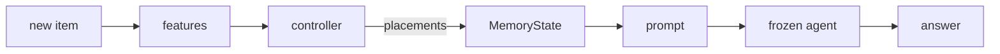

# memctl: a swappable memory controller for LLM agents

An LLM agent has a limited prompt. As a conversation grows, something must decide
what stays in the prompt and what is filed away. In this codebase that "something"
is a **memory controller**, and you can swap controllers with one line of config.

> Status: **Phase 2 of 4** (LoCoMo pipeline). See "What works today" below.

## The idea in one minute

Every piece of history is an **item** (a dialogue turn, tool output or observation).
At any moment each item is in exactly one of four **places**:

| Place | What it means | Cost |
|---|---|---|
| `CONTEXT` | In the prompt. | Its tokens count toward the budget `B`. |
| `STORE` | Searched automatically for each question (embedding top-k). | Free to hold; may not be found. |
| `ARCHIVE` | Cold storage. The prompt shows a one-line index entry; the agent calls `recall(id)` to read it. | Index line counts toward `B`; each recall costs tokens. |
| `DROPPED` | Deleted for good (can be switched off). | Nothing, but it is gone. |

The **controller** runs when a new item would push the prompt over budget, and at the
end of each session. It returns a list of placements, each with a plain-English reason.



More detail: [docs/architecture.md](docs/architecture.md).

## Quick start

```bash
uv venv --python 3.12
uv pip install --python .venv/bin/python -e ".[dev]"
.venv/bin/python -m pytest                       # all tests, under 1 second
.venv/bin/python -m memctl.run --config configs/smoke_keep_newest.yaml
.venv/bin/python -m memctl.run --config configs/smoke_jev.yaml --allow-fake-jev
```

Each run writes `runs/<date>_<controller>_<benchmark>_B<budget>_seed<seed>/` with
`config.yaml`, `decisions.jsonl` (one line per decision), `answers.jsonl` (one line
per question, including where each evidence item was), and `metrics.json`.

## Running on another machine

`docker compose run --rm memctl` runs the project in a container and uses an NVIDIA
GPU when there is one. See [docs/porting.md](docs/porting.md).

## Where things are

| File | What it does |
|---|---|
| `memctl/items.py` | `Item`, `Place`, token counting |
| `memctl/memory.py` | `MemoryState`: where every item is; enforces the budget; `recall()` |
| `memctl/features.py` | Per-item features any controller can use |
| `memctl/controllers/base.py` | `Controller` interface, `Placement`, the registry |
| `memctl/controllers/rules.py` | `full_context`, `keep_newest`, `lru`, `random`, `file_everything` |
| `memctl/controllers/jev.py` | `JevClient`, `FakeJevClient`, `JevController` |
| `memctl/controllers/oracle.py` | Hindsight oracle (evaluation only); exact plan in `oracle_ilp.py` |
| `memctl/agent.py` | Builds the prompt and handles `recall(id)` |
| `memctl/llm.py` | Model backends (`stub`, `hf`, `vllm`) and the disk cache |
| `memctl/episode.py` | Runs one conversation event by event |
| `memctl/metrics.py`, `judge.py` | F1, BLEU-1 and the LLM judge |
| `memctl/attribution.py` | One failure label per wrong answer |
| `memctl/summary.py` | Builds `metrics.json` |
| `memctl/run.py` | One command to run an experiment |
| `memctl/report.py`, `plots.py` | `report.md` and its charts |
| `memctl/benchmarks/` | `locomo.py` and a tiny `synthetic.py` |
| `docs/` | `architecture.md`, `jev.md`, `metrics.md`, `decisions.md` |

## Adding a controller

1. Write a file in `memctl/controllers/` with a class that implements
   `decide(state, features, budget) -> list[Placement]`.
2. Add one line to `registry()` in `memctl/controllers/base.py`.
3. Set `controller: {name: your_name}` in a config.

## What works today

| Phase | Content | State |
|---|---|---|
| 1 | Items, memory, controller interface, rule controllers, fake Jev, tests, smoke test | done |
| 2 | LoCoMo, real model (Qwen), oracle, BLEU-1 and judge, failure attribution, report | done (LongMemEval loader still to do) |
| 3 | Real Jev client, budget sweep, `memctl.compare` | not started |
| 4 | `learned_policy` stub and `reset`/`step` environment | not started |

Numbers from the synthetic benchmark and the stub model only show that the pipeline
runs. They are not results.

## A real run

```bash
uv pip install --python .venv/bin/python -e ".[dev,models]"
.venv/bin/python -m memctl.run --config configs/locomo_small.yaml --controller oracle
.venv/bin/python -m memctl.report runs/locomo_small/<run folder>   # rebuild a report
```

The first run downloads the answering model (`Qwen/Qwen3.5-4B`, 9.3 GB) and the judge
(`Qwen/Qwen3.5-2B`, 4.6 GB). Every
generation is cached in `cache/`, so a rerun takes seconds.
