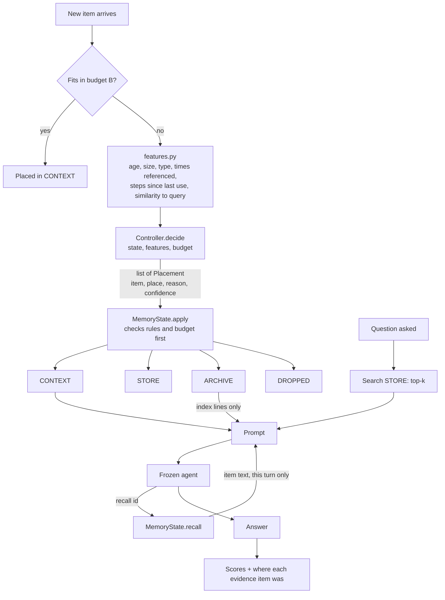

# Architecture

## One turn

## The rules MemoryState enforces

1. **Budget.** Tokens of all `CONTEXT` items plus the index lines of all `ARCHIVE`
   items never exceed `B`. A new item that does not fit waits in `state.incoming`;
   it is not in any place until the controller has made room.
2. **All or nothing.** `apply(placements)` checks the result before moving anything.
   If the result would break a rule it raises and the state is unchanged.
3. **Dropped is final.** A dropped item cannot be moved, searched or recalled.
4. **Only search and recall bring items back.** A controller cannot move a filed
   item back into `CONTEXT`. Retrieved and recalled items appear in the prompt for
   one question only and stay where they were.

## Who may see what

| Information | Controllers | Features | Agent | Evaluator | Oracle (Phase 2) |
|---|---|---|---|---|---|
| Item text and metadata | yes | yes | yes | yes | yes |
| Questions | no | no | yes, when asked | yes | yes |
| Evidence labels and gold answers | **no** | **no** | **no** | yes | yes |

Evidence labels live only on `Question` objects (`benchmarks/types.py`).
`episode.py` hands the controller a `MemoryState` and features, never a `Question`.
A test checks that `decisions.jsonl` contains no label fields.

## When the controller runs

| Trigger | When |
|---|---|
| `overflow` | a new item does not fit in the budget |
| `session_end` | a session of the conversation ends |
| `arrival` | every new item, only for controllers with `runs_on_every_arrival` (`file_everything`) |
